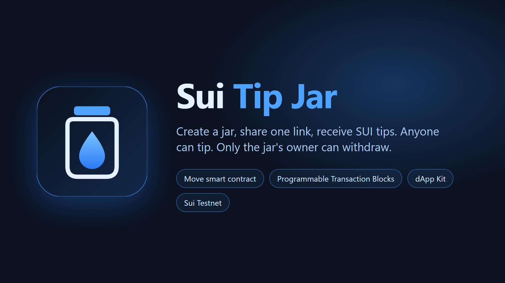
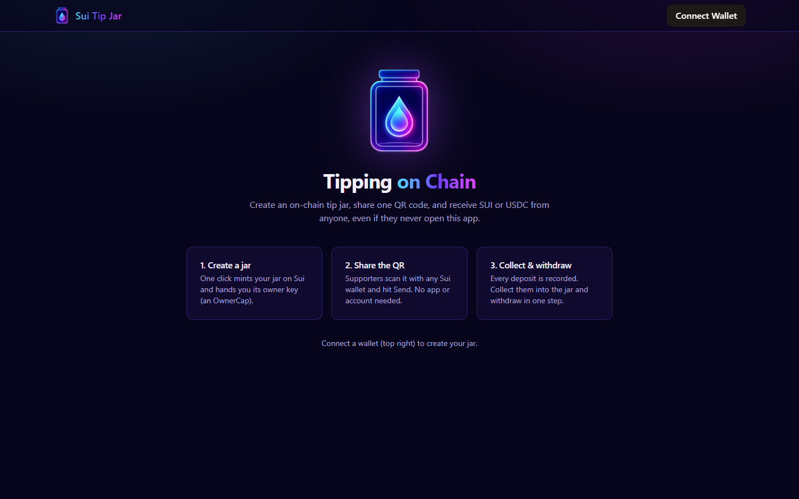
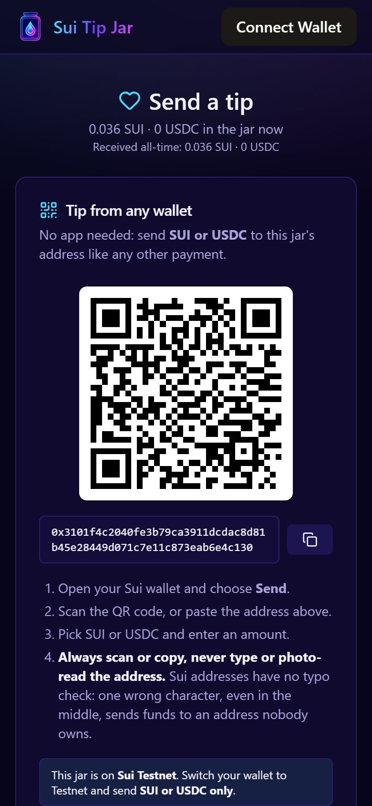

# Sui Tip Jar



A shared, on-chain tip jar on Sui. Anyone can tip **SUI or USDC** into a jar, from any wallet. Only the holder of that jar's `OwnerCap` can withdraw from it.

**Live app (testnet):** https://m1-antra.github.io/sui-tip-jar/

## Layout

This is a monorepo: the smart contract and the web app live side by side.

| Path | What it is |
| --- | --- |
| `move/tip_jar/sources/tip_jar.move` | Move contract (shared `TipJar` and owned `OwnerCap`) |
| `move/tip_jar/tests/tip_jar_tests.move` | `test_scenario` tests, including the wrong-cap attack |
| `frontend/` | React + dApp Kit web app (owner dashboard, tip page with QR code and activity) |
| `.github/workflows/deploy.yml` | Builds `frontend/` and deploys it to GitHub Pages on every push |
| `submission/` | Logo, cover image and screenshots |

There is no backend server. The browser talks to Sui directly: it writes through wallet-signed transactions and reads through the public fullnode (gRPC) and GraphQL APIs.

## Tech stack

| Layer | Technology |
| --- | --- |
| Blockchain | Sui (testnet) |
| Smart contract | Move 2024 edition, Sui framework (`coin`, `balance`, `event`, `transfer`) |
| Contract tests | `sui move test` with `sui::test_scenario` |
| Transactions | Programmable Transaction Blocks via `@mysten/sui` (TypeScript SDK v2) |
| Wallet connection | `@mysten/dapp-kit-react` (Slush and other Wallet Standard wallets) |
| Chain reads | `SuiGrpcClient` (objects, balances, coins), Sui GraphQL (events and per-address transaction history), BCS decoding |
| Frontend | React 19, TypeScript, Vite, Tailwind CSS, TanStack Query, lucide-react, qrcode.react |
| Hosting / CI | GitHub Pages via GitHub Actions |
| Tooling | Sui CLI (installed with `suiup`), Node.js, npm |

## Security model

- **Capability, not address checks:** withdrawing needs the jar's `OwnerCap` object. Only its owner can put it in a transaction.
- **A cap only opens its own jar:** every `withdraw*` and `collect_*` function asserts `cap.jar_id == object::id(jar)`. The `cap_from_another_jar_cannot_withdraw`, `collect_with_wrong_cap_fails` and `token_withdraw_with_wrong_cap_fails` tests cover this.
- **One balance per coin:** SUI lives in the jar's own `funds`. Other coins (USDC) live in a per-coin `TokenVault<T>` dynamic field, and the `*_token` functions reject SUI (`ENotAToken`), so SUI is never split across two balances.
- **Only the jar's module can reach deposits at the jar's address:** pulling them in needs `&mut` access to the jar's `UID`, which only `tip_jar` has.
- **Exact payments:** the client splits the exact tip off the gas coin, and `tip()` consumes the whole coin it is given.
- **No custody:** each jar holds its own `Balance<SUI>`. Nothing is pooled, and the website never holds funds.

## How it works

1. **Owner** connects a wallet and clicks **Create a jar**. The jar is a shared object that anyone can tip into. The owner receives an `OwnerCap`, which is the key to that jar.
2. The owner shares the tip link (`/?jar=<jar id>`). It opens a page with a **QR code** and the jar's address.
3. **Supporters** can tip in two ways:
   - **From any wallet (no app needed):** scan the QR code or paste the address into their wallet's normal **Send** screen, and send SUI or USDC. The coins land at the jar's address.
   - **In the app:** connect a wallet, pick **SUI or USDC**, and click **Tip**. For SUI the PTB splits the exact amount off the gas coin and calls `tip()`. For USDC, `coinWithBalance` gathers the exact amount from the tipper's USDC coins and calls `tip_token<USDC>()`.
4. **Direct deposits are counted, then collected.** A plain wallet send never runs contract code, so the app reads it from the chain. Depending on the wallet, it's either in the jar's address balance or a `Coin` object sent to the jar. The owner's card shows it as *waiting to collect*. **Collect deposits** calls `collect_address_deposits` / `collect_coin_deposit` (SUI) and `collect_token_address_deposits<USDC>` / `collect_token_coin_deposit<USDC>`. They move the deposits into the jar and add them to its totals.
5. **Withdraw all** runs one PTB: it collects any waiting deposits, calls `withdraw_all()` and `withdraw_all_token<USDC>()`, then sends both payouts to the owner. It needs one signature.
6. **Jar activity** is a public record of every app tip, direct deposit, collection and withdrawal. It merges contract events with the chain's transaction history for the jar's address.

| Home | Tip page (mobile) |
| --- | --- |
|  |  |

## Run the web app

```bash
cd frontend
npm install
npm run dev
```

Open http://localhost:5173 in a browser that has the [Slush](https://slush.app) wallet on **Testnet** with some testnet SUI.

## Build and test the contract

```bash
cd move/tip_jar
sui move build
sui move test
```

## Publish to testnet

```bash
sui client switch --env testnet
sui client faucet
cd move/tip_jar && sui client publish
```

Save the `PackageId` that the publish prints.

## Deployed (testnet)

- Package v2, original ID (types and SUI events): [`0x7032…e7bb`](https://suiscan.xyz/testnet/object/0x7032353131b3710055c4145beb5f6e5cb55e60903a25655fe181441f0cf8e7bb)
- Package v2, upgrade 2 (current code; adds USDC and any other coin): [`0xd1e8…a1c5`](https://suiscan.xyz/testnet/object/0xd1e81332173d6723c46e8505c55399e9d6bd679aa1fcef0aaaa7c79cb2eda1c5). It was an **upgrade**, not a new publish, because per-coin vaults are dynamic fields and `TipJar` itself didn't change, so every existing jar gained USDC support.
- USDC (Circle, testnet): `0xa1ec7fc00a6f40db9693ad1415d0c193ad3906494428cf252621037bd7117e29::usdc::USDC`. Get some at https://faucet.circle.com (Sui Testnet).
- Demo jar: [`0x3101…c130`](https://m1-antra.github.io/sui-tip-jar/?jar=0x3101f4c2040fe3b79ca3911dcdac8d81b45e28449d071c7e11c873eab6e4c130)
- v1 (retired): `0x8c14352695f80e3406e96189d8b722907e6535b67463c3d01031b1f1add88562`. v1 had no way to reach SUI sent straight to a jar's ID, which is what v2 fixes. v2 was published fresh, rather than as an upgrade, so `TipJar` could gain the `total_direct` field.

## Try it from the CLI

```bash
# create a jar (cap has no `drop`, so it must be transferred)
sui client ptb --move-call <PKG>::tip_jar::create --assign cap --transfer-objects "[cap]" @<YOUR_ADDRESS>

# tip 0.1 SUI: split the exact amount off gas, pass that coin in
sui client ptb --split-coins gas "[100000000]" --assign coins --move-call <PKG>::tip_jar::tip @<JAR> coins.0

# withdraw 0.05 SUI (needs the matching OwnerCap)
sui client ptb --move-call <PKG>::tip_jar::withdraw @<JAR> @<CAP> 50000000 --assign payout --transfer-objects "[payout]" @<YOUR_ADDRESS>

# simulate a wallet "Send" straight to the jar's ID (no contract call)
sui client ptb --split-coins gas "[10000000]" --assign c --transfer-objects "[c]" @<JAR>

# owner collects it: a Coin object sent to the jar...
sui client ptb --move-call <PKG>::tip_jar::collect_coin_deposit @<JAR> @<CAP> @<COIN_ID>
# ...or SUI sitting in the jar's address balance
sui client ptb --move-call <PKG>::tip_jar::collect_address_deposits @<JAR> @<CAP> <AMOUNT_MIST>
```
