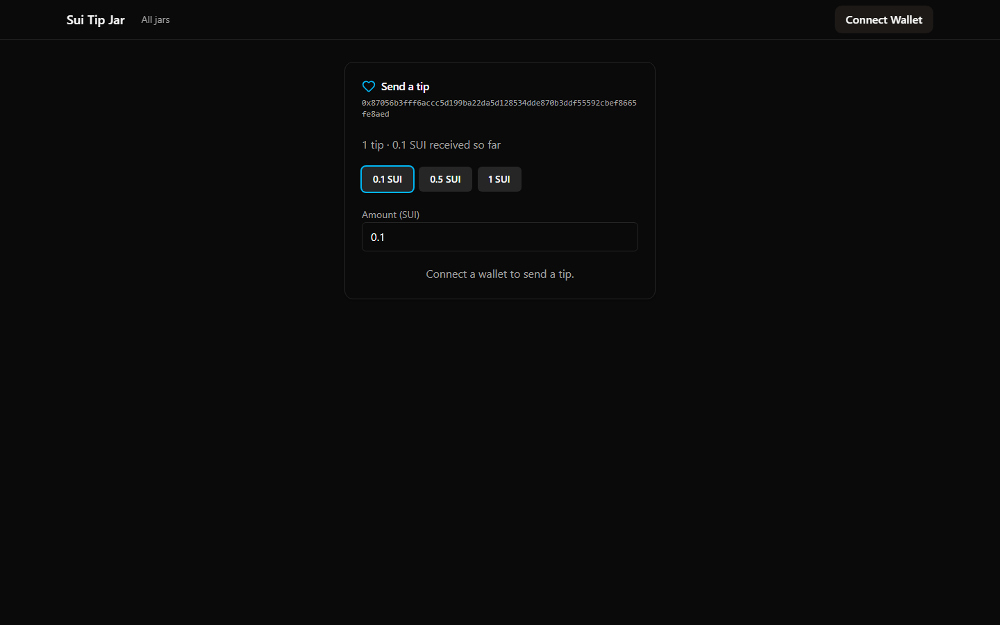
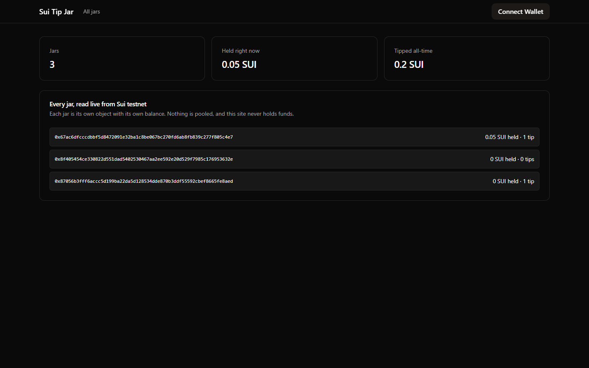

# Sui Tip Jar


A shared, on-chain tip jar on Sui. Anyone can tip SUI into a jar. Only the holder of that jar's `OwnerCap` can withdraw from it.

**Live app (testnet):** https://m1-antra.github.io/sui-tip-jar/

## Layout

This is a monorepo: the smart contract and the web app live side by side.

| Path | What it is |
| --- | --- |
| `move/tip_jar/sources/tip_jar.move` | Move contract (shared `TipJar` and owned `OwnerCap`) |
| `move/tip_jar/tests/tip_jar_tests.move` | `test_scenario` tests, including the wrong-cap attack |
| `frontend/` | React + dApp Kit web app (owner dashboard, tip page, all-jars view) |
| `ts/src/ptb.ts` | Standalone PTB builders for create, tip and withdraw (`@mysten/sui`) |
| `.github/workflows/deploy.yml` | Builds `frontend/` and deploys it to GitHub Pages on every push |
| `submission/` | Logo, cover image and screenshots |

There is no backend server. The browser talks to Sui directly: it writes through wallet-signed transactions and reads through the public fullnode (gRPC) and GraphQL APIs.

## Tech stack

| Layer | Technology |
| --- | --- |
| Blockchain | Sui (testnet) |
| Smart contract | Move 2024 edition, Sui framework (`coin`, `balance`, `event`, `transfer`) |
| Contract tests | `sui move test` with `sui::test_scenario` |
| Transactions | Programmable Transaction Blocks via `@mysten/sui` (TypeScript SDK v2) |
| Wallet connection | `@mysten/dapp-kit-react` (Slush and other Wallet Standard wallets) |
| Chain reads | `SuiGrpcClient` (objects), Sui GraphQL (`JarCreated` events), BCS decoding |
| Frontend | React 19, TypeScript, Vite, Tailwind CSS, TanStack Query, lucide-react |
| Hosting / CI | GitHub Pages via GitHub Actions |
| Tooling | Sui CLI (installed with `suiup`), Node.js, npm |

## Security model

- **Capability, not address checks:** withdrawing needs the jar's `OwnerCap` object. Only its owner can put it in a transaction.
- **A cap only opens its own jar:** `withdraw` asserts `cap.jar_id == object::id(jar)`. The `cap_from_another_jar_cannot_withdraw` test covers this.
- **Exact payments:** the client splits the exact tip off the gas coin, and `tip()` consumes the whole coin it is given.
- **No custody:** each jar holds its own `Balance<SUI>`. Nothing is pooled, and the website never holds funds.

## How it works

1. **Owner** connects a wallet and clicks **Create a jar**. The jar is a shared object that anyone can tip into. The owner receives an `OwnerCap`, which is the key to that jar.
2. The owner shares the tip link (`/?jar=<jar id>`).
3. **Supporters** open the link, connect a wallet and send a tip. The transaction splits the exact amount off their gas coin and passes it to `tip()`.
4. The owner clicks **Withdraw all**. `withdraw_all()` checks that the `OwnerCap` belongs to this jar before paying out.
5. **All jars** (`/?view=all`) lists every jar ever created, with how much each one currently holds. It finds them through their `JarCreated` events.

| Tip page | All jars |
| --- | --- |
|  |  |

## Run the web app

```bash
cd frontend
npm install
npm run dev
```

Open http://localhost:5173 in a browser that has the [Slush](https://slush.app) wallet on **Testnet** with some testnet SUI.

## Build and test the contract

```bash
cd move/tip_jar
sui move build
sui move test
```

## Publish to testnet

```bash
sui client switch --env testnet
sui client faucet
cd move/tip_jar && sui client publish
```

Save the `PackageId` that the publish prints.

## Deployed (testnet)

- Package: [`0x8c14…8562`](https://suiscan.xyz/testnet/object/0x8c14352695f80e3406e96189d8b722907e6535b67463c3d01031b1f1add88562)
- Demo jar: `0x67ac6dfcccdbbf5d8472091e32ba1c8be067bc270fd6ab8fb839c277f805c4e7`

## Try it from the CLI

```bash
# create a jar (cap has no `drop`, so it must be transferred)
sui client ptb --move-call <PKG>::tip_jar::create --assign cap --transfer-objects "[cap]" @<YOUR_ADDRESS>

# tip 0.1 SUI: split the exact amount off gas, pass that coin in
sui client ptb --split-coins gas "[100000000]" --assign coins --move-call <PKG>::tip_jar::tip @<JAR> coins.0

# withdraw 0.05 SUI (needs the matching OwnerCap)
sui client ptb --move-call <PKG>::tip_jar::withdraw @<JAR> @<CAP> 50000000 --assign payout --transfer-objects "[payout]" @<YOUR_ADDRESS>
```
